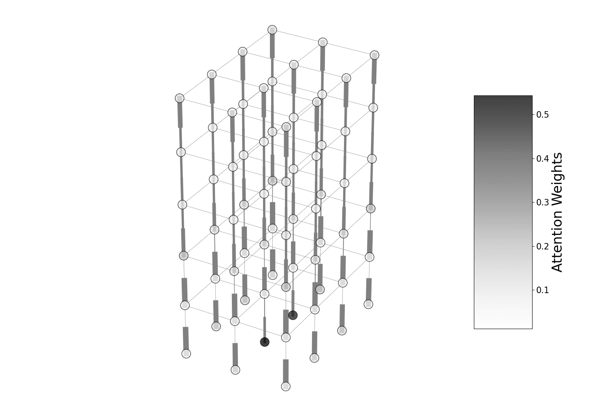

# GNN-LSTM-based Fusion Model for Structural Dynamic Responses Prediction

## Introduction
In this study, I developed a novel **`GNN-LSTM-based` fusion model framework**. It can predict the nonlinear responses history of acceleration, velocity, and displacement for each floor of any SMRF structure between 4 and 7 stories in height.


In addition, two _LSTM-optimized_ learning strategies, including a **packing padded sequences(PPS) strategy** and a **sequences compression(SC) strategy**, are also proposed in this project. The experimental results of this study demonstrated that the PPS learning strategy successfully reduced the noise in the sequence data, improving the stability of the training process and the model’s predictive ability, and the SC learning strategy significantly short- ened the training time with only a minor reduction in model accuracy while retaining the complete information of the original sequences in the compressed sequences.

<p align="center">
  
  

Finally, the fusion model’s graph embedding and graph embedding network were visualized. The graph embeddings of the structures were highly correlated with their first modal periods. Moreover, the **rigid diaphragm** setting in structures appeared in the message transmission trend of the **graph attention network (GAT)**, which implies that the model learned the physically meaningful message transmission during the training process.

<p align="center">
  
  

---

## Installation
- Linux, CUDA>=11.3
- Python>=3.9.7
- pyg>=2.0.3
- pytorch>=1.10.2

Anaconda is recommended to use to create a conda environment:
```
# Optional. If it doesn't work, just make sure you have installed the above packages.
conda env create -f ./environment.yml
```

---

## Download inference data
```
bash download.sh
```
Following the [checkData.ipynb](./checkData.ipynb) to see the detail of the dataset 

---

## Inference
In this repository, I provide the best GAT model for inference. Follow the steps bellow to predict Acceleration, Velocity, Displacement dataset.
- Acceleration Dataset
```
python inference.py --output_dir ./Inference/Acceleration --response_type Acceleration
```

- Velocity Dataset
```
python inference.py --output_dir ./Inference/Velocity --response_type Velocity
```

- Displacement Dataset
```
python inference.py --output_dir ./Inference/Displacement --response_type Displacement
```

---

## Train
1. create folder:
```
mkdir -p ./Results/GCN_LSTM
mkdir -p ./Results/GAT_LSTM
```
2. Go to [train_GCN_LSTM.arg.py](./train_GCN_LSTM_arg.py) or [train_GAT_LSTM.arg.py](./train_GAT_LSTM_arg.py). Then set the training enviornment and learning target
   - --pack_mode: PPS strategy
   - --compression_rate: SC strategy. Feel free to try 10, 20, 40
   - --response_type: Acceleration or Velocity or Displacement
   - --n_layers: # of LSTM layer
3. Train the model
```
# use GCN as aggregation function
python train_GCN_LSTM.py

# use GAT as aggregation function
python train_GAT_LSTM.py
``` 
4. Test the model
```
# use GCN as aggregation function
python test_GCN_LSTM.py --output_dir <folder path of target GCN_LSTM model>

# use GAT as aggregation function
python test_GAT_LSTM.py --output_dir <folder path of target GAT_LSTM model>
```
